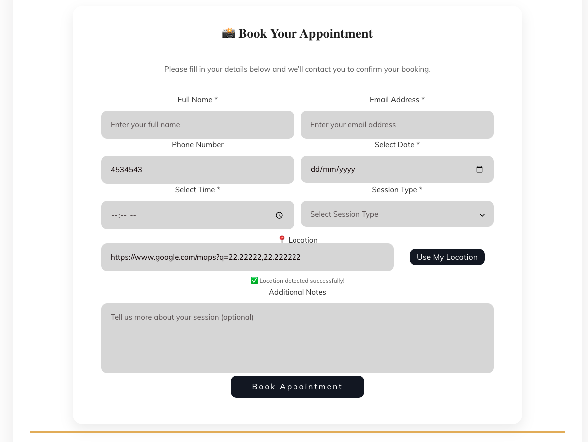

# 📸 Appointment Booking Form

A modern and responsive **appointment booking form** built using **HTML**, **CSS (Bootstrap 5)**, and **JavaScript**.  
It includes smart geolocation detection, clean UI, and elegant design suitable for photographers, salons, or any booking-based business.

---

## 🚀 Features

- Responsive & mobile-friendly (Bootstrap 5)
- Google Maps location detection via `navigator.geolocation`
- Elegant design with rounded fields & shadows
- Clean layout using `row` & `col` Bootstrap structure
- Easy to integrate into any website

---

## 🧩 Technologies Used

- **HTML5**
- **CSS3**
- **Bootstrap 5**
- **Vanilla JavaScript**

---

## 📂 Project Structure


---

## 🖼️ Preview



---

## ⚙️ How to Use

1. Clone this repository:
   ```bash
   git clone https://github.com/mohamedwazery/appointment-form.git


MIT License
Copyright (c) 2025 Mohamed Wazery